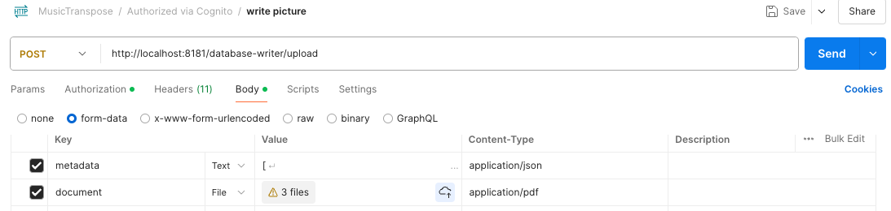

# Requirements Backend

## Endpoints

### Uploadfiles

**POST  /database-writer/upload**  
  - receives: multipart/form-data as for app defined  
    - metadata
      - Json Array
        ```json
        [
            {
                "id": 1,
                "music_id": 1,
                "description": "Example description",
                "dateAdded": 1622906400,
                "register_id": 1,
                "part": "Example part"
            },{
                "id": 1,
                "music_id": 1,
                "description": "Example description",
                "dateAdded": 1622906400,
                "register_id": 1,
                "part": "Example part"
            },{
                "id": 1,
                "music_id": 1,
                "description": "Example description",
                "dateAdded": 1622906400,
                "register_id": 1,
                "part": "Example part"
            }
        ]
        ```  
  - 
    - document  
      - application/pdf Array  
  
  - metadata array length and document array length must match otherwise return error  
  - first element in metadata array belongs to document array

  

**POST  /database-writer/active/{id}**  
  - set active music-piece  
  - url parameter id as int(datatype) for corresponding music-piece  

**POST  /database-writer/music?name=< music-name >**  
  - request: `http://0.0.0.0:8181/database-writer/music?name=Pretuller Polka`  
  - response: Register added with name: Pretuller Polka  
  - adds new music title to backend 
  - body none  

**POST  /database-writer/register?name=< register-name >**  
  - request: `http://0.0.0.0:8181/database-writer/register?name=tuba`
  - response: Register added with name: tuba

  - adds new register in backend  
  - body none  


### Download

**GET  /database-reader/active-scores**   
  returns list of parts for music piece (metadata)  
  - body application/json  
```json
[
  {
    "s_date_added": "2021-06-05T15:20:00.000+00:00",
    "s_description": "Example description",
    "s_nr": 9,
    "music": {
      "m_nr": 1,
      "m_name": "Alle meine Entchen"
    },
    "register": {
      "r_nr": 1,
      "r_name": "Posaune"
    },
    "s_part": "Example part"
  },
  {
    "s_date_added": "2021-06-05T15:20:00.000+00:00",
    "s_description": "Example description",
    "s_nr": 10,
    "music": {
      "m_nr": 1,
      "m_name": "Alle meine Entchen"
    },
    "register": {
      "r_nr": 1,
      "r_name": "Posaune"
    },
    "s_part": "Example part"
  }
  ...
]
```


**GET  /database-reader/score/{id}**  
  returns one pdf File representing the Music Score  
    - send: score as pdf  
    - body application/pdf  

**GET  /database-reader/registers**  
  returns list of registers in organization  
    - body application/json (JSON Array) 
```json 
[
    {
        "r_nr": 1,
        "r_name": "posaune"
    },
    {
        "r_nr": 2,
        "r_name": "klarinette"
    },
    {
        "r_nr": 3,
        "r_name": "tuba"
    }
]
```

**GET  /database-reader/music**  
  returns list of music pieces in organization   
    - body application/json (JSON Array)  
```json 
[
    {
        "m_nr": 1,
        "m_name": "Alle meine Entchen"
    },
    {
        "m_nr": 2,
        "m_name": "Pretuller Polka"
    },
    {
        "m_nr": 3,
        "m_name": "Happy Birthday"
    }
]
```


